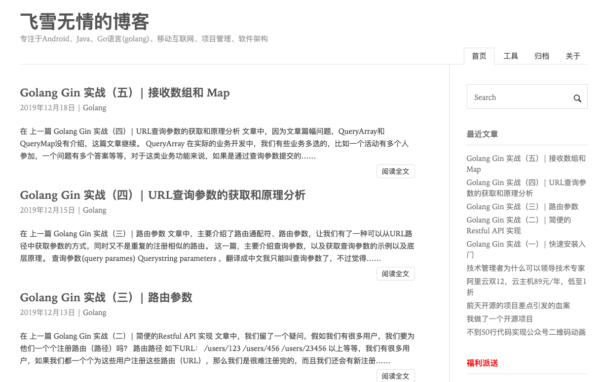

# Maupassant

Maupassant theme, ported to Hugo.

1. 预览效果:[飞雪无情的博客](http://www.flysnow.org)
2. [English Docs](README_EN.md)

一款非常简洁、性能高的Hugo主题，适配不同的设备（PC，Mobile等）。 主要是基于 Typecho [Cho](https://github.com/pagecho/maupassant/), 从 [JokerQyou](https://github.com/JokerQyou/maupassant-hugo) forked，修改和添加了很多功能而成，如GA统计、最近的文章、标签云、自定义菜单、按日期归档等 .

## Preview



## 功能特性

1. 支持Local Search 站内搜索
2. 最近发表的文章支持，显示最近的10篇 
3. 分类支持，并且可以显示分类内的文章数量
4. 标签云支持
5. 文章目录支持
6. 一键回到页面顶部
13. 支持关键字SEO优化
6. 自定义菜单支持，不限个数，自定义排序
7. 自定义友情链接支持
8. 支持文章按年份日期进行归档
9. 支持GA分析统计
17. 不蒜子页面计数器支持
11. 代码高亮、代码行号
10. sitemap站点地图
5. RSS支持，并且可以自动发现RSS
14. Google站内搜索
15. See Also 支持
16. Disqus评论支持
18. 自定义css、js
19. utteranc评论
20. 部分自定义的shortcode
21. 文章自定义摘要
22. 自定义广告支持
23. 自定义备案信息
24. 自定义图片CDN
25. 图片点击放大

## 下载安装

```bash
cd <YOUR Bolg Root Dir>
git clone https://github.com/flysnow-org/maupassant-hugo themes/maupassant
```

## 配置

#### 依赖要求

Hugo Version >= v 0.60.0

#### 应用主题

```toml
theme = "maupassant"
```

#### 快速开始

在主题的 [exampleSite](exampleSite/) 示例目录下有`config.toml `文件，把`config.toml `文件复制到你的站点目录下，然后根据自己的需求修改即可

**PS: 一定要使用`post`目录，而不是`posts`,一定要记住，所以如果你使用`hugo`命令，你应该`hugo new post/filename.md`这样创建**

**PS: 一定要使用`post`目录，而不是`posts`,一定要记住，所以如果你使用`hugo`命令，你应该`hugo new post/filename.md`这样创建**

**PS: 一定要使用`post`目录，而不是`posts`,一定要记住，所以如果你使用`hugo`命令，你应该`hugo new post/filename.md`这样创建**


#### 代码高亮

从Hugo v0.60.0开始，默认使用`Goldmark`渲染MD文件，并且默认开启了代码高亮，所以该主题原来的代码高亮兼容出现问题，
经过取舍，最终还是选用了Hugo原生的代码高亮方式，去掉了原来主题自带的基于JS的代码高亮。

新的Hugo内置的代码高亮使用非常代码，默认不用任何配置就可以，如果你需要开启行号、或者更换代码样式，可以参考如下配置：

*config.toml*
```toml
[markup]
  [markup.highlight]
    lineNos = true
    style = "github"
```

更多配合和样式参考:

[Configure Markup](https://gohugo.io/getting-started/configuration-markup)
[Syntax Highlighting](https://gohugo.io/content-management/syntax-highlighting/)

#### 自定义菜单

```toml
[menu]

  [[menu.main]]
    identifier = "books"
    name = "新书"
    url = "/books/"
    weight = 2

  [[menu.main]]
    identifier = "archives"
    name = "归档"
    url = "/archives/"
    weight = 3

  [[menu.main]]
    identifier = "about"
    name = "关于"
    url = "/about/"
    weight = 4
```

`identifier`标志符必须是唯一的，不能重复；`weight`用于排序，值越小越靠前。

####  文章目录（大纲）

该主题支持文章目录（大纲）,大纲是通过`h1~h7`标题自动生成，在MD文件里就是`##`这类标题的标记，这里建议最多使用两层文章目录，而且最好是从`h2`开始，便于SEO优化。
如果要开启一篇文章的文章目录，只需要在`Front Matter` 添加`toc=true`即可，默认是不开启文章目录的。

```toml
toc = true
```
当左侧空白空间宽度超过100px时，则显示悬浮目录。

#### Local Search 站内搜索

站内搜索默认是关闭的，如果需要使用需要以下步骤开启。

1. 检查`config.toml`的`disableKinds`配置项,是否禁用了RSS，如果禁用需要开启。
2. 在`config.toml`中找到`[params]`配置段落，增加`localSearch = true`开启站内搜索
3. 在`content`目录下新建`search`目录,并且在`search`目录中新建`index.md`文件，内容如下

```
---
title: "搜索"
description: "搜索页面"
type: "search"
---
```

然后`hugo server`启动，打开你的站点，就可以在右上角的搜索框里输入关键字进行站内搜索了。


#### 友情链接

```toml
[[params.links]]
  title = "Android Gradle权威指南"
  name = "Android Gradle权威指南"
  url = "http://yuedu.baidu.com/ebook/14a722970740be1e640e9a3e"
[[params.links]]
  title = "常用开发工具CDN镜像"
  name = "常用开发工具CDN镜像"
  url = "http://mirrors.flysnow.org/"
```

`params.links`是一个数组，所以我们可以自定义很多友情链接。`name`表示显示的链接文本，`title`表示鼠标悬停在友情链接时，显示的文本。

#### 广告模块

广告模块在侧边栏，可以灵活配置，让博主可以放一些超链接广告、或者图片链接广告。

```toml
[[params.ads]]
  title = "领取￥1888阿里云产品通用代金券"
  url = "https://promotion.aliyun.com/ntms/yunparter/invite.html?userCode=jdg9oj97"

[[params.ads]]
  title = "领取￥1888阿里云产品通用代金券"
  url = "https://promotion.aliyun.com/ntms/act/vmpt/aliyun-group/home.html?userCode=jdg9oj97"
  img = "https://img.alicdn.com/tfs/TB17qJhXpzqK1RjSZFvXXcB7VXa-200-126.jpg"
[[params.ads]]
  title = "领取￥1888阿里云产品通用代金券"
  url = "https://promotion.aliyun.com/ntms/act/enterprise-discount.html?userCode=jdg9oj97"
  img = "https://img.alicdn.com/tfs/TB1aDXhXpzqK1RjSZFvXXcB7VXa-259-194.jpg"
```

`params.ads`是一个数组，所以我们可以自定义很多广告。如果`img`存在，则优先使用图片广告,`title`表示鼠标悬停在广告链接时，显示的文本。

具体效果参考 [http://www.flysnow.org/](http://www.flysnow.org/)

#### 添加GA分析统计

该主题已经支持了GA分析统计，只需要在`config.toml`配置里加入如下配置即可。
```toml
googleAnalytics = "GA ID"
```

#### 文章归档支持

Hugo默认是不支持生成归档文件的，需要自己实现。该主题已经实现了文章归档，只需要在新建`content/archives/index.md`文件，文件内容为：

```md
title: "归档"
description: Android资深工程师 ，Go和Java打杂师，《Android Gradle权威指南》作者，Android官方技术文档译者
type: archives
```

`title`和`description`都可以换成你自己的，但是`type`必须是`archives`。

`content/archives/index.md`表示在`content/archives/`目录下的`index.md`文件

#### 添加备案信息

现在网站要求添加备案信息，本主题也进行了支持，使用方式非常简单，在`config.toml`的`params`配置中添加如下设置：

```toml
[params]
  beian = "粤ICP备XXXXXXX号-1"
```

以上配置中的备案信息要换成自己的

#### 图片点击放大

将会引入jquery.js 和 fancybox 的css和js

```toml
[params]
  fancybox = true
```

#### 图片CDN

将会在mark中引入的图片src前面加上设置的host, 有http前缀的路径不会在前面加入host
注意: 路径后面不要带/ 
> 可直接使用jsdelivr加速 后面跟上github仓库即可 

```toml
[params.image_cdn]
    enable = true
    Host = "https://cdn.jsdelivr.net/gh/user/user.github.io"
```

#### Disqus

该主题支持Disqus评论，如果要启用Disqus，可以在`config.toml`里添加如下配置即可.

```toml
disqusShortname = "yourdiscussshortname"
```

替换成你自己的Disqus名字即可。

#### 自定义文章摘要

该主题采用了Hugo内置的摘要支持，大家可以通过`<!--more-->`自定义自己的摘要，也可以使用自动摘要，使用自动摘要时，可以在`config.toml`中设置摘要的长度

```toml
# 默认是70
summaryLength = 140 
```

#### 开启版权声明

该主题支持开启版权声明，如果要启用版权声明，可以在`config.toml`里添加如下配置即可。

```toml
[params.cc]
    name = "知识共享署名-非商业性使用-禁止演绎 4.0 国际许可协议"
    link = "https://creativecommons.org/licenses/by-nc-nd/4.0/"
```

其中`name`和`link`可以换成自己使用的版权声明协议和链接

#### utteranc

该主题支持utteranc评论，这是一个基于Github  Issue的评论系统，使用方便，不用翻墙即可评论。
可以在`config.toml`里添加如下配置即可.更多详见 [https://utteranc.es](https://utteranc.es)

```toml
[params.utteranc]
    enable = true
    repo = ""    # 存储评论的Repo，格式为 owner/repo
    issueTerm = "pathname"  #表示你选择以那种方式让github issue的评论和你的文章关联。
    theme = "github-light" # 样式主题，有github-light和github-dark两种
```
对于以上issueTerm可以选择的配置有
1. `pathname` 以路径的方式，推荐选项，这样你换域名的时候就不用担心评论找不到了
2. `url` 全链接URL路径的方式。
3. `title` 按页面title标题的方式。

其他还有几个不常用，这里就不再赘述了。

#### 不蒜子页面计数器支持

该主题支持不蒜子这个极简的页面计数器支持，如果要启用不蒜子，可以在`config.toml`里添加如下配置即可.

```toml
[params]
  busuanzi = true
```

#### 关于分类的名称转为小写的问题

`Hugo 0.55` 版本之前, 会有分类转成小写的问题，Hugo提供了`preserveTaxonomyNames`配置，把它设置为`true`就可以了保持原来分类的名字了。
在 `Hugo 0.55` 这个版本，[hugo 移除了 preserveTaxonomyNames 配置](https://gohugo.io/content-management/taxonomies/#example-removing-default-taxonomies)，
模板已经默认获取 tag 和 categories 的原始字符用来展示, 大小写的问题已经优雅的解决了。

#### 禁止URL路径小写

默认情况下，URL字符串里的字母都是小写的，这对于分类名、标签名是大写的来说，博客迁移后（比如从Hexo到Hugo），原来的链接就失效了，
为了解决这个问题，Hugo提供了`disablePathToLower`配置。

```toml
## 是否禁止URL Path转小写
disablePathToLower = true
```

#### 自定义CSS&JS

```
[params]
  # 这里我存放在了主题的static文件夹里，根目录的似乎也可以
  customCSS = ['douban.css', 'other.css']
  # if ['custom.css'], load '/static/css/custom.css' file
  customJS = ['douban.js']
  # if ['custom.js'], load '/static/js/custom.js' file
```

#### 添加了部分自定义的shortcode

* Octopress blockquote (blockquote.html)
* Wikipedia Link Generator (wp.html)

```

```

* youku（youku.html）

#### 绘图支持

- 序列图(使用[js-sequence](https://bramp.github.io/js-sequence-diagrams/))
  1. 全局使用，在`config.toml`中添加如下配置
  
     ```toml
     [params.sequenceDiagrams]
         enable = true
         options = ""            # default: "{theme: 'simple'}"
     ```
     
  2. 每篇文章单独设置，在`Front Matter` 添加如下内容
  
     ```yaml
     sequenceDiagrams
       enable: true
     ```
  
   将代码块的语言标识符设置为`sequence`。例如
  
  ```
  ​```sequence
  Alice->Bob: Hello Bob, how are you?
  Note right of Bob: Bob thinks
  Bob-->Alice: I am good thanks!
  ​```
  ```
  
- 流程图（使用[flowchart.js](http://flowchart.js.org/)）
  1. 全局使用，在`config.toml`中添加如下配置
  
     ```tom
     [params.flowchartDiagrams]
       enable = true
       options = ""
     ```
     
  2. 每篇文章单独设置，在`Front Matter` 添加如下内容
  
     ```yaml
     flowchartDiagrams:
       enable: true
     ```
  
  
   将代码块的语言标识符设置为`flowchat`或者`flow`。例如
  
   ```
  ​```flow
  st=>start: Start
  op=>operation: Your Operation
  cond=>condition: Yes or No?
  e=>end
  
  st->op->cond
  cond(yes)->e
  cond(no)->op
  ​```
   ```
  
- graphviz（[viz.js](https://github.com/mdaines/viz.js))

  需要对每篇文章单独设置是否启用，在`Front Matter` 添加如下内容

  ```yaml
  graphviz:
    enable: true
  ```

  将代码块的语言标识符设置为`viz-<engin>`， engin是选用的graphviz绘图引擎的名称，包括`circo`、`dot`、`fdp`、`neato` 、`osage`和`twopi`。例如
  
  ```
  ​```viz-dot
  digraph G {
  
  	subgraph cluster_0 {
  		style=filled;
  		color=lightgrey;
  		node [style=filled,color=white];
  		a0 -> a1 -> a2 -> a3;
  		label = "process #1";
  	}
  
  	subgraph cluster_1 {
  		node [style=filled];
  		b0 -> b1 -> b2 -> b3;
  		label = "process #2";
  		color=blue
  	}
  	start -> a0;
  	start -> b0;
  	a1 -> b3;
  	b2 -> a3;
  	a3 -> a0;
  	a3 -> end;
  	b3 -> end;
  
  	start [shape=Mdiamond];
  	end [shape=Msquare];
  }
  ​```
  ```

## 贡献

欢迎大家贡献，不限于代码、Issue，功能特性，想法等等，期待看到你的PR或者ISSUE。

## 其他平台上的 Maupassant 主题

+ Typecho：https://github.com/pagecho/maupassant/
+ Octopress：https://github.com/pagecho/mewpassant/
+ Farbox：https://github.com/pagecho/Maupassant-farbox/
+ Wordpress：https://github.com/iMuFeng/maupassant/
+ Ghost: https://github.com/LjxPrime/maupassant/
+ Hexo: https://github.com/tufu9441/maupassant-hexo
+ Hugo: https://github.com/flysnow-org/maupassant-hugo

```

```
